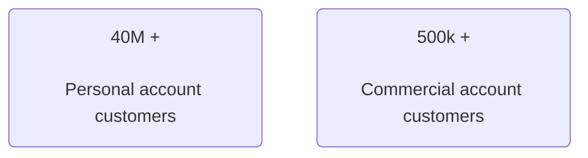
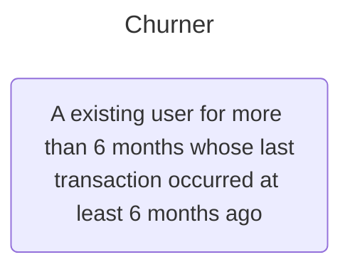
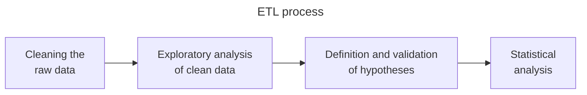
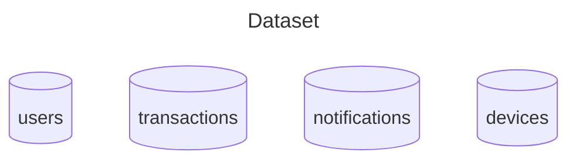
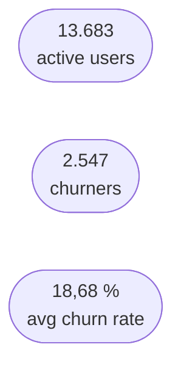
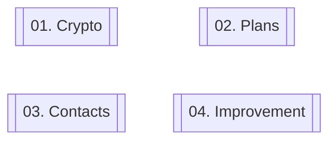

# le-wagon-final-project

This is a course completion project of a 400-hour training bootcamp in Data Analytics, at Le Wagon Programming School.

The streamed presentation can be accessed by [clicking here](https://www.youtube.com/live/yZtvrdxnJSU) **video in Portuguese*

Technologies and methods used:
- Python libraries in Google Collaboratory
- SQL in Google BigQuery
- Data Visualization
- Statistical tests - can be found in this repository **comments in Portuguese*

This project aimed to study churners at Neo Bank (or Revolut), a digital bank that offers a range of services and financial products with the difference that customers do not need to worry about hidden fees.

<h1 align="center">SITUATION</h1>

One of the main pain points was the lack of visibility into churners, who are customers who abandoned the service.

  <h1 align="center">TASK</h1>

Based on this scenario, our project aimed to meet 3 main objectives:

#### 1️⃣ Find a definition of churner that makes sense for the business needs, considering the available data

#### 2️⃣ Raise hypotheses guiding the project and validate them through statistical methods

#### 3️⃣ Extract actionable insights that help to better understand this evasion and propose improvement actions

Our time frame was from January to October 2018, that is, this was the period chosen to conduct this study.

Therefore, the project was developed considering a churner as:

Portanto, o projeto foi desenvolvido considerando churner como um usuário que tem conta há pelo menos 6 meses e que está há 6 meses ou mais sem fazer uma transação

  <h1 align="center">ACTIONS</h1>

The flowchart above, known as ETL that means to extract, transform and load, represents the main activities performed, and it was necessary to pay close attention to data cleaning and analysis. Hypothesis validation as well as statistical analyzes were carried out to derive valuable insights from these analysis, seeking to follow scientific methodology.

  <h1 align="center">RESULTS</h1>

## Age

    
| Generation | Born date |
| :---: | :---: |
| Baby boomer  | < 1965  |
| Gen X | ≥ 1965   ≤ 1987  |
| Millenial | > 1987   ≤ 1996 |
| Gen Z | ≥ 1997 |

Nós constatamos que há relação entre a idade e a taxa de churn, com a geração Baby Boomer (ou seja, aqueles que nasceram até 1965) e o início da geração X (nascidos entre 65 e 87) sendo os maiores churners

E os Millennials (nascidos entre 88 e 96) com os menores valores. Apesar disso não ser compatível com o movimento global, isso pode ser explicado pelo recorte temporal utilizado e o fato dos Millenials e Gen Z terem uma tendência maior a fazer o que é chamado de churn e return, que é a evasão do produto e uma possível volta caso exista necessidade ou quando os benefícios voltam a ser vantajosos.

 

 

## Crypto user

 Fazendo uso dessa divisão em gerações, podemos ver o impacto do uso de criptomoedas para todas as idades. Quando um usuário habilita a possibilidade de investir em criptomoedas, isso reduz muito a possibilidade de se tornar churner,  tendo o maior impacto na geração Z, com a queda de 22,5% para 4,5%. A queda da taxa de churn é maior nos usuários mais novos, talvez pela facilidade com as novas tecnologias, mas o impacto é visível nos quatro grupos.

 

 

## Plans

 Outro ponto que chamou a nossa atenção foi que clientes do plano gratuito (STANDARD) possuem uma taxa de churn muito maior que dos planos pagos, que são o PREMIUM e o METAL. 

O plano METAL, inclusive, teve uma taxa de churn de 0% e o plano PREMIUM de apenas 1,67%. Uma diferença enorme pro plano STANDARD com 20%.

 

 

## Number of contacts

 Também constatamos uma relação entre o número de contatos e a taxa de churn. Quanto mais conectado com outros usuários, menores são as chances de um cliente parar de utilizar o produto. 

Um usuário com 0 contatos tem um churn rate de 32%, bem acima da média de referência de quase 19%, e esse número vai caindo quanto mais contatos um usuário possui.

 

 

Isso também é constatado pela análise dos usuários por países, onde é possível ver que a taxa de churn costuma ser menor nos países com uma média de contatos por usuário maior. 

Aqui temos a nossa taxa média de churn e é possível ver como países com mais contatos por usuário estão consideravelmente abaixo desse número, com a Romênia com 9,4% e a Irlanda com 10,5%, por exemplo. 

Seguindo o gráfico, vemos que os clientes de países com mais de 20% de taxa de churn são os que menos têm contatos por usuário.

 

 

## Devices

 Por fim, vimos que usuários com dispositivo Apple tendem a fazer mais churn. É possível que exista uma relação com erros nos aplicativos, considerando que existiram alguns picos de falhas de envio de notificações para usuários ao longo dos meses.

O mês de março foi o mês de maior erros no envio de notificações e também o mês com o maior número de churn no período (332 usuários).
O mês de outubro, em contrapartida, foi o mês com o maior número de notificações enviadas com sucesso e foi o mês com o segundo menor número de churn, com 191 usuários, atrás apenas do mês de fevereiro (172 usuários).

  <h1 align="center">INSIGHTS</h1>
 Proposal for developing action plans to meet these 4 drivers:

1️⃣ **Encourage users to invest in cryptocurrencies.** It has been observed that users who invest in cryptocurrencies have a lower churn rate than the opposite. And looking deeper, dividing these users into age groups, the younger they are, the lower the churn. Therefore, the suggestion is not only to have a greater investment in crypto investors but also to focus on younger users.  
2️⃣ **Offer more benefits and promotions for the free plan,** which has a higher churn rate and number of users compared to the paid plan, which has a much smaller number of users.  
3️⃣ **Encourage users to have more contacts saved in the app through promotions and notifications.** This is because users with 1 or 0 contacts have, respectively, a churn of about 23% and 33%, while users with 10 or more contacts have an average churn of 6.5%.  
4️⃣ **Improve performance and user experience on the mobile app,** especially on the iOS system, which has a higher percentage of churn compared to Android users.
