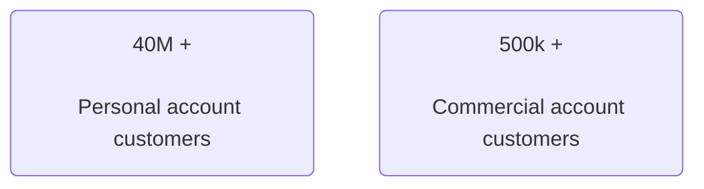
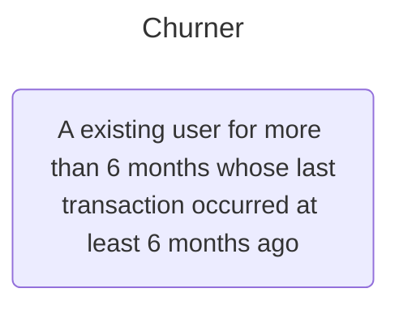
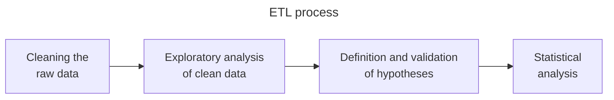
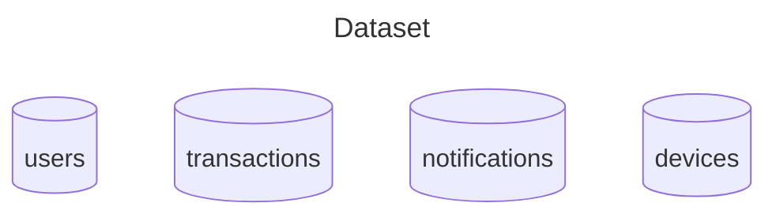
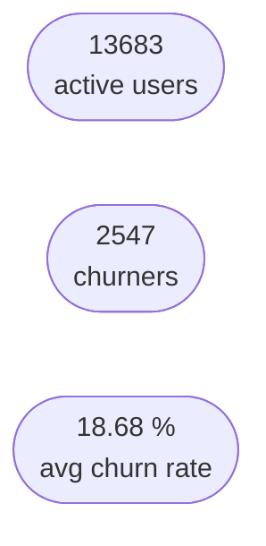
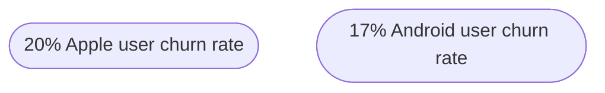
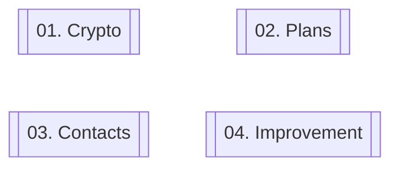

# le-wagon-final-project

This is a course completion project of a 400-hour training bootcamp in Data Analytics, at [Le Wagon Programming School](https://www.lewagon.com/).

The streamed presentation can be accessed by [clicking here](https://www.youtube.com/live/yZtvrdxnJSU) **video in Portuguese*

     

Team Members:
- Lucas Pontes *[profile](https://www.linkedin.com/in/lucasdpontes/)*
- Clara Wolff *[profile](https://www.linkedin.com/in/clarawolff93/)*
- Ynara Oliveira *[profile](https://www.linkedin.com/in/ynaraoliveira/)*

Technologies and methods used:
- Python libraries in Google Collaboratory
- SQL in Google BigQuery
- Data Visualization
- Statistical tests - can be found in this repository **comments in Portuguese*

This project aimed to study churners at [Revolut](https://www.revolut.com/) (or Neo Bank) company, a digital bank that offers a range of services and financial products with the difference that customers do not need to worry about hidden fees.

<h1 align="center">SITUATION</h1>

One of the main pain points was the lack of visibility into churners, who are customers who abandoned the service.

  <h1 align="center">TASK</h1>

Based on this scenario, our project aimed to meet 3 main objectives:

#### 1️⃣ Find a definition of churner that makes sense for the business needs, considering the available data

#### 2️⃣ Raise hypotheses guiding the project and validate them through statistical methods

#### 3️⃣ Extract actionable insights that help to better understand this evasion and propose improvement actions

Our time frame was from January to October 2018, that is, this was the period chosen to conduct this study.

Therefore, the project was developed considering a churner as:

  <h1 align="center">ACTIONS</h1>

The flowchart above, known as ETL that means to extract, transform and load, represents the main activities performed, and it was necessary to pay close attention to data cleaning and analysis. Hypothesis validation as well as statistical analyzes were carried out to derive valuable insights from these analysis, seeking to follow scientific methodology.

  <h1 align="center">RESULTS</h1>

## Age

    
| Generation | Born date |
| :---: | :---: |
| Baby boomer  | < 1965  |
| Gen X | ≥ 1965   ≤ 1987  |
| Millenial | > 1987   ≤ 1996 |
| Gen Z | ≥ 1997 |

A relationship was found between age and the churn rate, with the Baby Boomer generation and the beginning of Generation X being the biggest churners.

The fact that Millennials have the lowest churn rate values ​​contradicts global trends, but this can be explained by the time frame used and the fact that Millennials and Gen Z have a greater tendency to do what is called **churn** and **return**, which is product evasion and a possible returns if there is a need or when the benefits become advantageous again.

 

 

## Crypto user

 Segmenting by generation, the impact of using cryptocurrencies for all ages can be visualized. When a user activates the feature to invest in cryptocurrencies, this greatly reduces the possibility of becoming a churner, having the biggest impact on generation Z, dropping from 22.5% to 4.5%. The churn rate drop is greater among younger users, probably due to the ease with new technologies, but the impact is visible in all four groups.

 

 

## Plans

 Another attention point was that free-plan users (*i.e.* STANDARD) have a much higher churn rate than paid ones (*i.e.* PREMIUM and METAL).

The METAL plan even has a churn rate of 0%, while the PREMIUM has just 1.67%. A huge difference when compared to STANDARD (20%).

 

 

## Number of contacts

 A relationship was also found between the number of contacts and the churn rate. The greater the connection between users, the lower the chances of a customer stopping using the product.

A user with 0 contacts has a churn rate of 32%, well above the benchmark average of ≈19%, and this number decreases the more contacts a user has.

 

 

In the graph below, segmented by country, the churn rate (dashed line) tends to be lower in countries with a higher average number of contacts per user.

Countries with more contacts per user are considerably below this number. Ex: Romania with 9.4% and Ireland with 10.5%.

Furthermore, customers from countries with more than a 20% churn rate have the fewest contacts per user.

 

 

## Devices

 Finally, Apple users tend to churn more. It is possible that there is a relationship with crashes in the app, considering that there have been peaks in failures in sending notifications over the months.

March has the most errors when sending notifications and was also the month with the highest churners in the period (332 users).

However, in October there were more notifications sent successfully and it was the 2nd month at lowest churners (191 users).

  <h1 align="center">INSIGHTS</h1>
 Proposal for developing action plans to meet these 4 drivers:

1️⃣ **Encourage users to invest in cryptocurrencies.** It has been observed that users who invest in cryptocurrencies have a lower churn rate than the opposite. And looking deeper, dividing these users into age groups, the younger they are, the lower the churn. Therefore, the suggestion is not only to have a greater investment in crypto investors but also to focus on younger users.  
2️⃣ **Offer more benefits and promotions for the free plan,** which has a higher churn rate and number of users compared to the paid plan, which has a much smaller number of users.  
3️⃣ **Encourage users to have more contacts saved in the app through promotions and notifications.** This is because users with 1 or 0 contacts have, respectively, a churn of about 23% and 33%, while users with 10 or more contacts have an average churn of 6.5%.  
4️⃣ **Improve performance and user experience on the mobile app,** especially on the iOS system, which has a higher percentage of churn compared to Android users.
